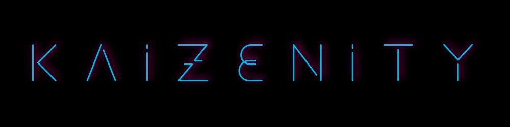
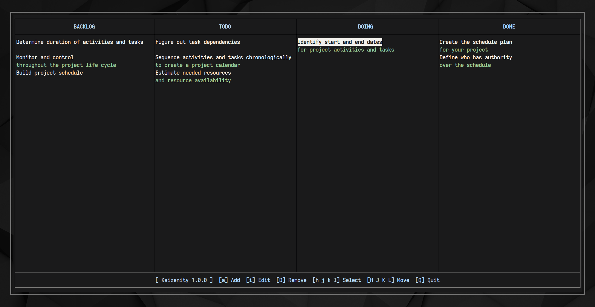

`Kaizenity` is a minimalistic console-based personal [Kanban board](https://en.wikipedia.org/wiki/Kanban_board) / task manager for small projects with `VI`-like key bindings

## Installation
Make sure you have setup a `Go >=1.6` development environment

It is necessary that the `GOPATH` environment variable is configured and your `PATH` includes `$GOPATH/bin` (please see [docs](https://golang.org/doc/code#GOPATH) page for more information)

Then use the following command:

    $ go install github.com/ctznfive/kaizenity@latest

The binary will be installed into `$GOPATH/bin`:

    $ kaizenity
    
### Compile a program into an executable file

Or you can run the `go build` command from the directory with the source files to compile the code into an executable:

    $ go build
    
Then use the following command on Linux or Mac:

    $ ./kaizenity
    
On Windows:
    
    $ kaizenity.exe

## Key Bindings
| Key | Function |
|:---:| --- |
| <kbd>a</kbd> | Add a new card to the current column |
| <kbd>i</kbd> | Edit the current card |
| <kbd>D</kbd> | Delete the current card |
| <kbd>j</kbd> | Move the cursor down the column |
| <kbd>k</kbd> | Move the cursor up the column |
| <kbd>l</kbd> | Move the cursor to the next column |
| <kbd>h</kbd> | Move the cursor to the previous column |
| <kbd>J</kbd> | Move the card down |
| <kbd>K</kbd> | Move the card up |
| <kbd>L</kbd> | Move the card to the next column |
| <kbd>H</kbd> | Move the card to the previous column |
| <kbd>Q</kbd> | Exit the application |

## Customization
`Kaizenity` don't have a config file, instead you can customize by edit the source code file `kaizenity.go`

Examples of customizing:

- Change keybindings
- Change names and number of columns on the board
- Change the default column
- Change the path to the `JSON` file where the cards are stored
- Setting colors

## Contributing
If you'd like to contribute, ask questions or share your opinions, please feel free to open an issue
